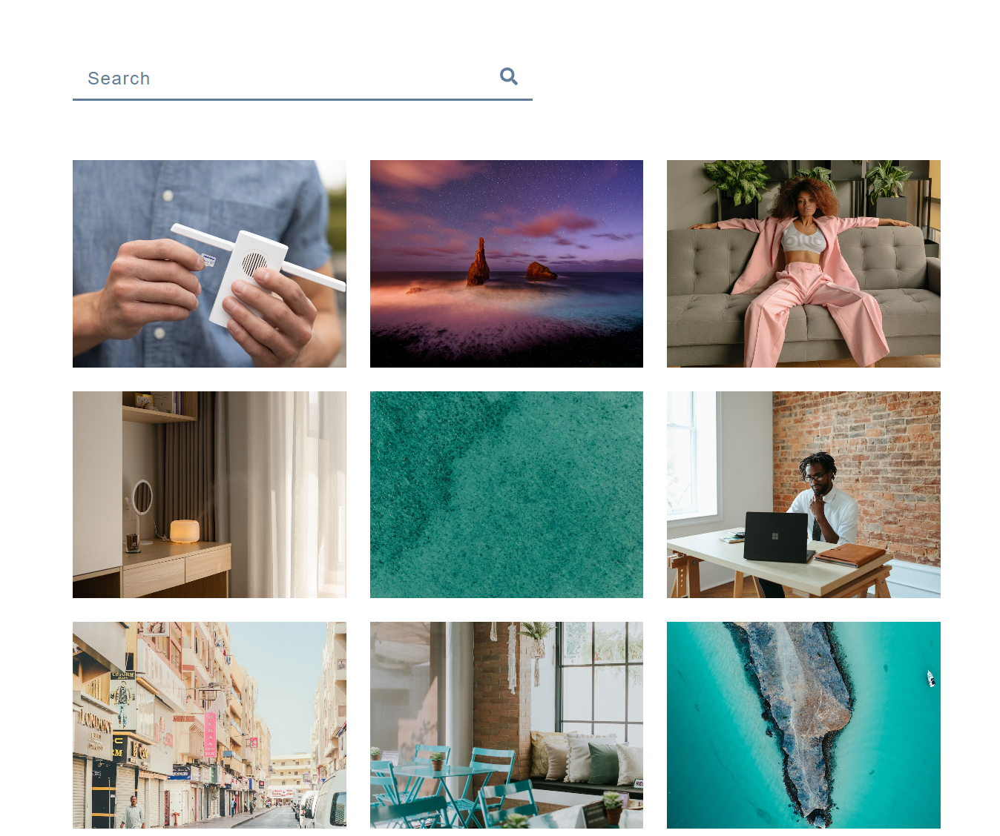

# Stock Photos Website

Course exclusive project from [React Projects](https://react-projects.netlify.app/) by [John Smilga](https://github.com/john-smilga).

## Link

- [Project URL](https://stock-photos-website-react.netlify.app/) (hosted on Netlify)

## Screenshot

## Project

Users should be able to:

- See photos and scroll to load more of them
- Search for photos

## Built with

- Semantic HTML5 markup
- CSS custom properties (provided by the course instructor)
- JavaScript
- React
- [Unsplash API](https://unsplash.com/developers)

## Author

Chiara Stefanelli - Front-End Development Student based in Italy

- Website - [Chiara Stefanelli](https://chiarastefanelli.netlify.app/)
- LinkedIn - [Chiara Stefanelli](https://www.linkedin.com/in/chiarastefanelli/?locale=en_US)
